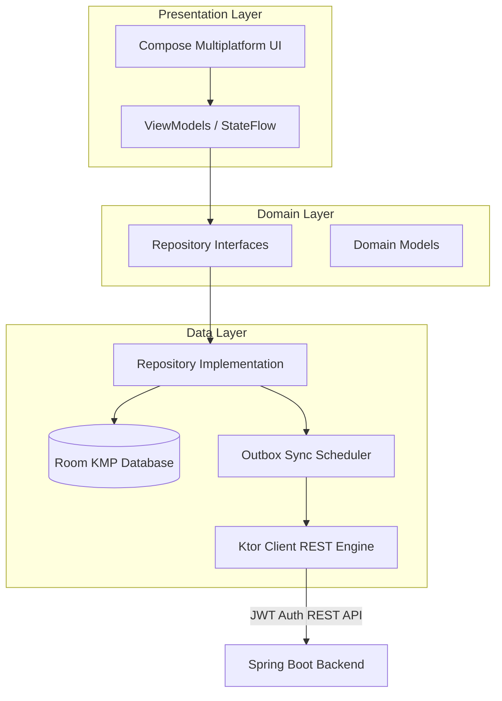
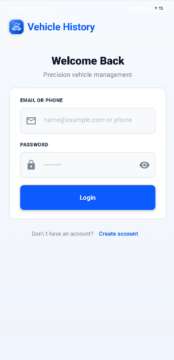
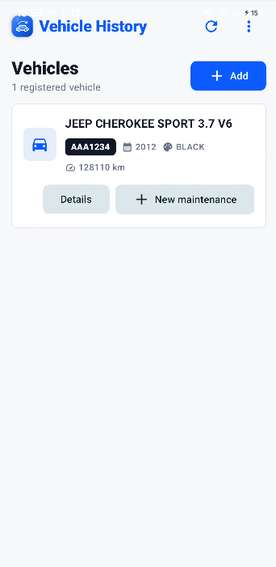
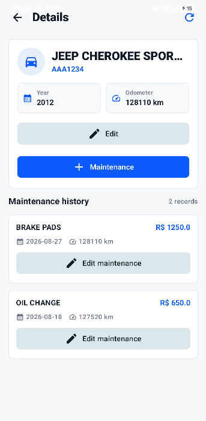
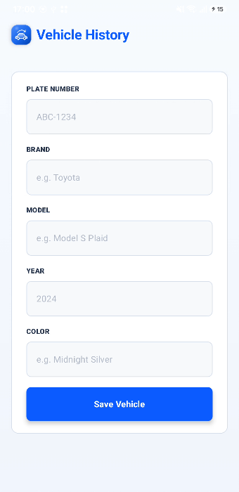
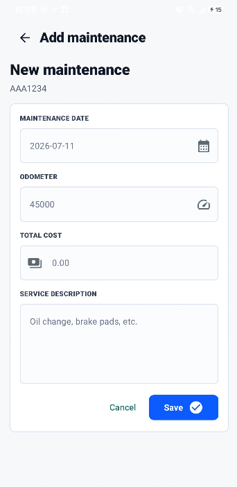

# Vehicle Maintenance History — Mobile

[](https://github.com/mmetznerm/vehicle-maintenance-history-kmp/actions/workflows/ci.yml)


Kotlin Multiplatform companion app for the [Vehicle Maintenance History backend](https://github.com/mmetznerm/vehicle-maintenance-history). It lets a vehicle owner sign in, register a vehicle, and record maintenance history from Android or iOS.

The project is a work in progress focused on a shared mobile codebase, Clean Architecture, and an incremental local-first experience.

## Highlights

- Shared Compose Multiplatform UI for Android and iOS
- Login and owner-registration flows
- Vehicle home, vehicle details, vehicle registration, and maintenance registration screens
- Clean Architecture (Data, Domain, Presentation) with MVVM / MVI presentation state management
- Local persistence with Room Multiplatform & SQLite bundled driver
- Offline-first Outbox Pattern queueing local changes for background server sync
- Shared networking with Ktor Client and JWT token storage abstraction

## Architecture & Data Flow



## Stack

- **Platforms:** Android & iOS (Shared Kotlin Multiplatform codebase)
- **UI & Navigation:** Compose Multiplatform, Material 3, Navigation Compose, Material Extended Icons.
- **Architecture & Dependency Injection:** Clean Architecture, MVVM / MVI pattern, Koin (Core, ViewModel, Compose) for Dependency Injection, StateFlow & Coroutines.
- **Local Persistence & Offline Sync:** Room Multiplatform (with KSP schema generation, bundled SQLite Driver), Offline Outbox Pattern (`OutboxOperationEntity`, `SyncStatus`).
- **Networking & Auth:** Ktor Client (OkHttp for Android, Darwin for iOS, Mock engine for unit testing), Ktor Auth (JWT Token Store abstraction), Kotlinx Serialization (JSON).
- **Background Tasks & Testing:** WorkManager (`androidx.work`), `kotlin.test`, `kotlinx-coroutines-test`, Ktor Client Mock.

## CI/CD Pipeline

The project includes an automated GitHub Actions workflow (`Mobile CI`):
- **Build & Test:** Compiles the Android application target (`assembleDebug`) and executes all shared multiplatform unit test suites (`allTests`) on every pull request and push to `main`.

## Screenshots

| Sign-in screen | Dashboard | Vehicle details |
| :---: | :---: | :---: |
|  |  |  |

| Vehicle registration | Maintenance registration |
| :---: | :---: |
|  |  |

## Run locally

Prerequisites: a current Android Studio installation and a compatible JDK. Xcode is also required to run the iOS target.

Build the Android app:

```powershell
.\gradlew.bat :composeApp:assembleDebug
```

Run the shared tests:

```powershell
.\gradlew.bat :composeApp:allTests
```

To run on iOS, open `iosApp` in Xcode and start a simulator.

For local API calls, add the API URL to your ignored `local.properties` file. The repository includes `local.properties.example` as a reference; keep your own `sdk.dir` entry unchanged.

## Current scope

Local vehicle and maintenance flows are implemented. Backend synchronization, refresh-token handling, resilient offline retries, image upload, and iOS Keychain storage are planned next.

## Documentation & Architecture

- [Architecture Decision Records (ADRs)](docs/adr/)
- [Pull Request Template](.github/pull_request_template.md)
- [Security Policy](SECURITY.md)

## Related project

The web application and Spring Boot API live in [Vehicle Maintenance History](https://github.com/mmetznerm/vehicle-maintenance-history).
