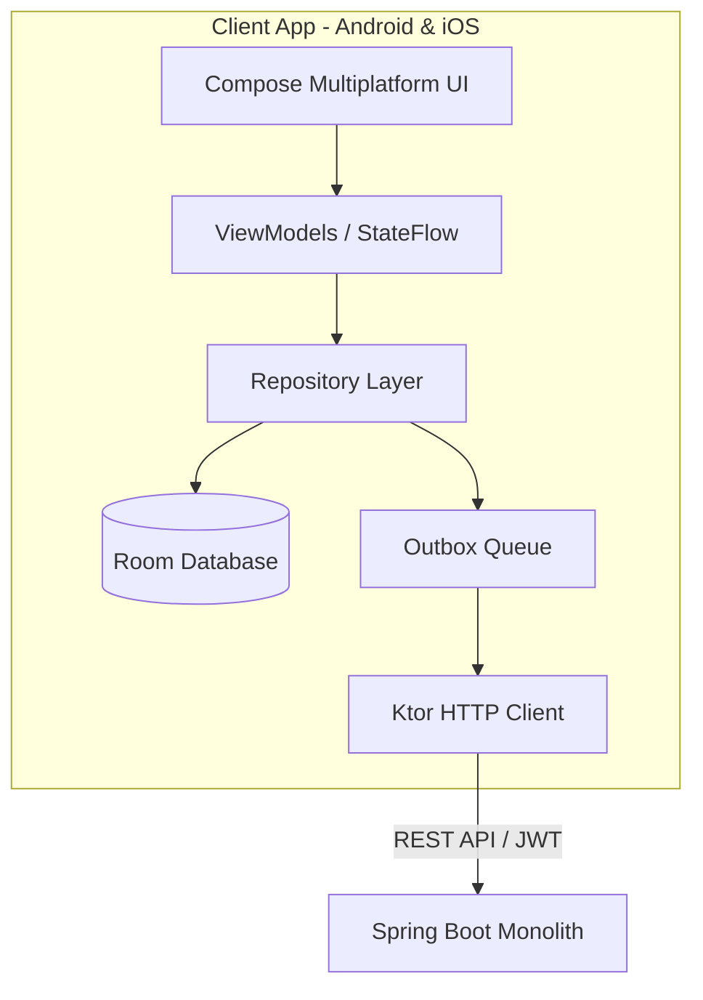

# Mobile Roadmap — Kotlin Multiplatform

O **Vehicle Maintenance History Mobile** é o aplicativo companheiro desenvolvido em **Kotlin Multiplatform (KMP)** e **Compose Multiplatform** para Android e iOS.

> 📌 **Fonte de Verdade para o Status Operacional**: O acompanhamento do status em tempo real de cada estória (`BACKLOG`, `READY`, `IN PROGRESS`, `BLOCKED`, `DONE`) é mantido de forma centralizada no **[GitHub Project: Vehicle Maintenance History — Roadmap](https://github.com/users/mmetznerm/projects)** e nas **[GitHub Issues](https://github.com/mmetznerm/vehicle-maintenance-history/issues)** do repositório principal.

Este documento detalha o **Roadmap Mobile**, alinhado estritamente com as **14 estórias verticais do produto**.

---

## Arquitetura Mobile

### Camadas e Tecnologias
- **UI & Apresentação**: Compose Multiplatform (Material 3), Navigation Compose, StateFlow e ViewModels (`androidx.lifecycle`).
- **Injeção de Dependências**: Koin (`koin-core`, `koin-compose`, `koin-viewmodel`).
- **Persistência Local (Local-First)**: Room Multiplatform com driver SQLite embutido.
- **Sincronização Offline**: Outbox Pattern (`OutboxOperationEntity`, `SyncStatus.PENDING`).
- **Rede & Autenticação**: Cliente HTTP Ktor (OkHttp no Android, Darwin no iOS, Mock Engine em testes), abstração de repositório de JWT tokens.
- **Tarefas em Segundo Plano**: Android WorkManager / iOS Background Tasks framework.

---

## Roadmap de Estórias Mobile

| # | Estória | Issue | Status Inicial | Escopo Específico Mobile |
|---|---|:---:|:---:|---|
| **01** | STORY-001 — Separar claramente CI de AWS/CD | [#76](https://github.com/mmetznerm/vehicle-maintenance-history/issues/76) | `READY` | Garantir que o pipeline `Mobile CI` no GitHub Actions execute builds Android (`assembleDebug`) e suíte de testes multiplatform (`allTests`) de forma totalmente isolada. |
| **02** | STORY-002 — Vehicle Domain v2 | [#77](https://github.com/mmetznerm/vehicle-maintenance-history/issues/77) | `BACKLOG` | Atualizar a entidade `VehicleEntity` no Room, modelos de domínio, validações (placa, VIN), e telas Compose (formulário de veículo, detalhes e cartões). |
| **03** | STORY-003 — Maintenance Domain v2 | [#78](https://github.com/mmetznerm/vehicle-maintenance-history/issues/78) | `BACKLOG` | Evoluir `MaintenanceEntity`, adicionar seletores de categoria, detalhar custos (peças vs mão de obra), oficina, mecânico, e garantia na UI Compose. |
| **04** | STORY-004 — Attachments, Photos and Documents | [#79](https://github.com/mmetznerm/vehicle-maintenance-history/issues/79) | `BACKLOG` | Integração com Câmera e Galeria nativas em Android/iOS, cache local de imagens, entidade de anexos no Room, e upload multipart via Outbox/Ktor. |
| **05** | STORY-005 — Backend Sync API | [#80](https://github.com/mmetznerm/vehicle-maintenance-history/issues/80) | `BACKLOG` | Preparar DTOs de sincronização, suporte a timestamps (`clientUpdatedAt`), UUIDs estáveis e idempotência no cliente Ktor. |
| **06** | STORY-006 — KMP Offline Sync | [#81](https://github.com/mmetznerm/vehicle-maintenance-history/issues/81) | `BACKLOG` | Motor de sincronização robusto: `OutboxSyncScheduler`, retries com backoff exponencial, monitor de conectividade, status de sync na UI, WorkManager (Android) e BGTaskScheduler (iOS). |
| **07** | STORY-007 — Dashboard | [#82](https://github.com/mmetznerm/vehicle-maintenance-history/issues/82) | `BACKLOG` | Tela inicial do app redesenhada com métricas de veículo, atalhos rápidos de cadastro, alertas de manutenção e estatísticas agregadas. |
| **08** | STORY-008 — Vehicle Expenses | [#83](https://github.com/mmetznerm/vehicle-maintenance-history/issues/83) | `BACKLOG` | Suporte local e remoto a despesas gerais (combustível, impostos, seguro, pedágio), Room `ExpenseEntity`, formulário de despesas e gráficos de custo/km. |
| **09** | STORY-009 — Preventive Maintenance Rules | [#84](https://github.com/mmetznerm/vehicle-maintenance-history/issues/84) | `BACKLOG` | Leitura e exibição de regras preventivas por veículo na UI (indicadores de saúde: verde, amarelo, vermelho). |
| **10** | STORY-010 — Notifications and Reminders | [#85](https://github.com/mmetznerm/vehicle-maintenance-history/issues/85) | `BACKLOG` | Agendamento e exibição de Notificações Locais Push no Android (NotificationManager) e iOS (UNUserNotificationCenter) para lembretes de manutenção. |
| **11** | STORY-011 — Vehicle Sharing and Permissions | [#86](https://github.com/mmetznerm/vehicle-maintenance-history/issues/86) | `BACKLOG` | Suporte a veículos compartilhados na UI, insígnias de permissão (`OWNER`, `EDITOR`, `VIEWER`), ocultação de ações de edição para leitos. |
| **12** | STORY-012 — Vehicle History Report | [#87](https://github.com/mmetznerm/vehicle-maintenance-history/issues/87) | `BACKLOG` | Botão para solicitar, baixar e visualizar o relatório PDF do veículo diretamente no aplicativo mobile. |
| **13** | STORY-013 — Vehicle External Data | [#88](https://github.com/mmetznerm/vehicle-maintenance-history/issues/88) | `BACKLOG` | Preenchimento automático do formulário de veículo via consulta por placa/VIN com fallback manual se desconectado. |
| **14** | STORY-014 — Production Infrastructure | [#89](https://github.com/mmetznerm/vehicle-maintenance-history/issues/89) | `BACKLOG` | Ajustes de configuração do cliente Ktor para apontar para o domínio de produção com HTTPS e gerenciamento seguro de tokens (Keychain iOS / EncryptedSharedPreferences Android). |

---

## Guia de Execução

As estórias do aplicativo mobile devem ser executadas em sincronia com o repositório principal de backend. Siga o fluxo de execução descrito em [`docs/stories/README.md`](../../vehicle-maintenance-history/docs/stories/README.md).
